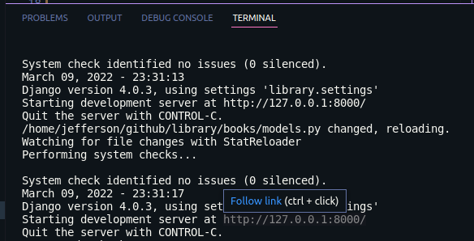
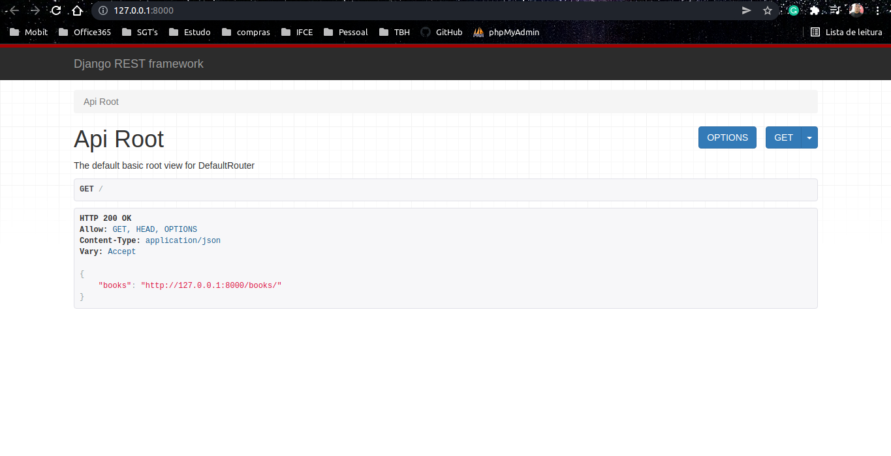
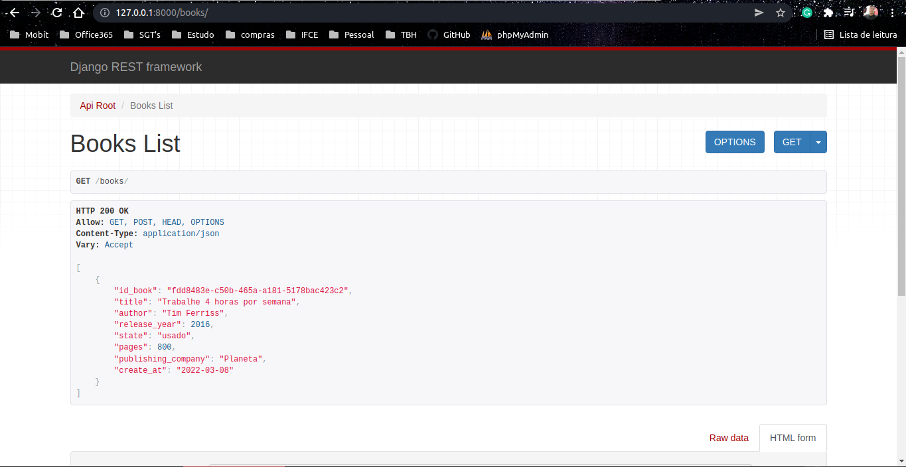
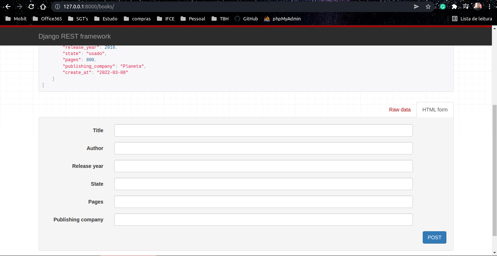
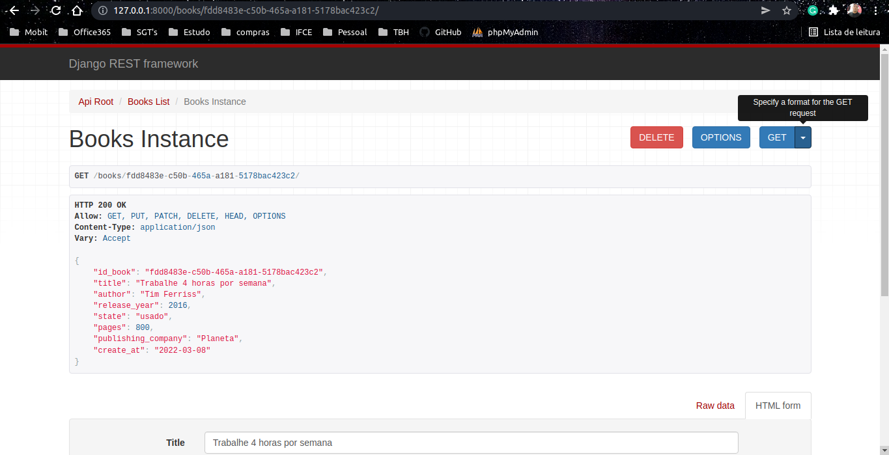

# library
Api python/Django Rest of books

## 1
```
$  git clone https://github.com/jeffersonsantos26/library.git
```

## 2
```
$  cd library
```

## 3
```
$  python3 -m venv venv
```

## 4
```
$  source venv/bin/activate
```

## 5
```
$  pip3 install django djangorestframework
```

## 6
```
$  python3 manage.py runserver
```
#
# Observe the IP and port available and access!


#
# Check the access path provided by the root api


#
# check registered books!


#
# Register your books !


#

## To delete, go to http://127.0.0.1:8000/books/[id_book]


